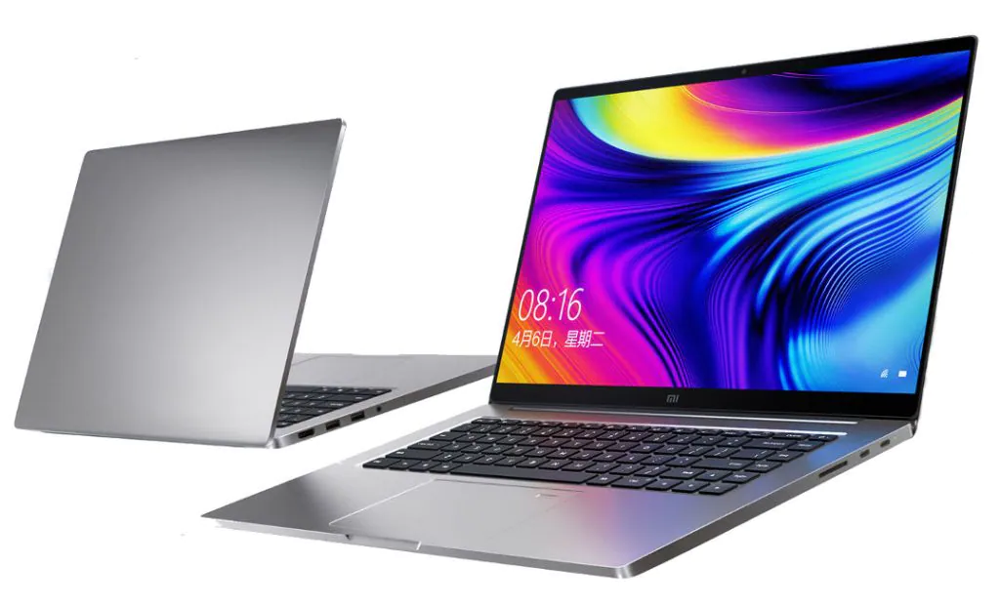
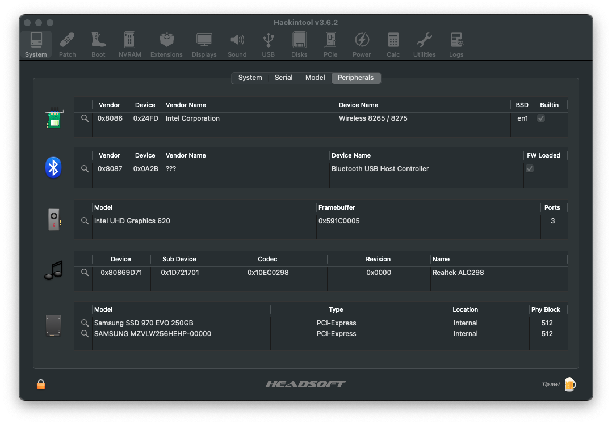
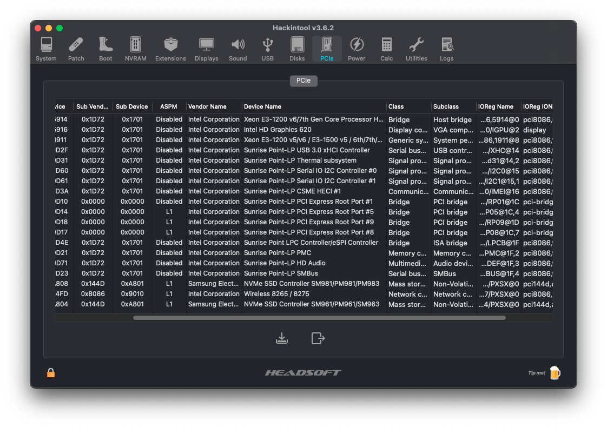
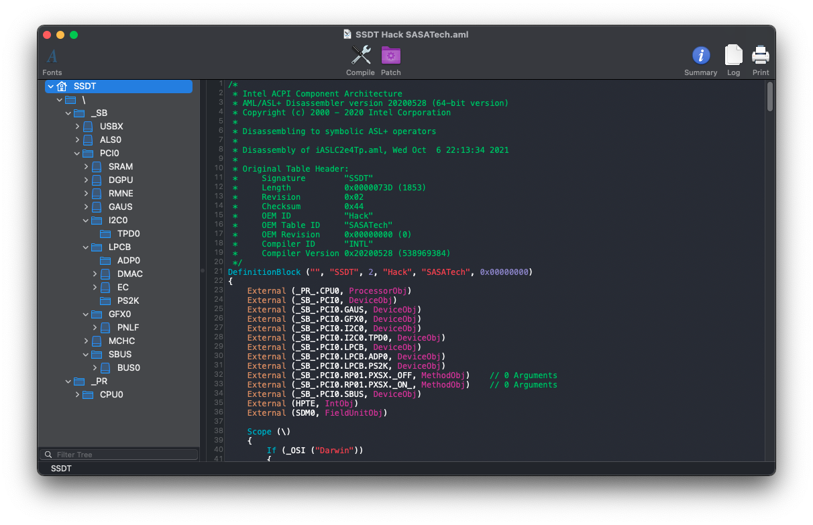

# Xiaomi-Notebook-Pro-Hackintosh

#### *Leggilo in un'altra lingua: [Italiano](README.md).* :it:

## macOS Big Sur/Monterey correctly installed on Xiaomi Notebook Pro 2017/2018

# Specs:

| Components       | Model                                |
| ---------------- | ------------------------------------ |
| Notebook         | Xiaomi Notebook Pro 2017/2018        | 
| CPU              | Intel Core i5 8250U/i7 8550U         | 
| iGPU             | Intel® UHD Graphics 620              |
| WiFi + Bluetooth | Intel Wireless-AC 8265               |
| Audio            | Realtek ALC298 (layout 30/99)        |
| RAM              | 8/16 GB DDR4 2400 Mhz                |
| NVMe macOS       | Samsung 970 Evo 256gb                |
| NVMe Windows     | Samsung PM961 256gb                  |
| SMBIOS           | MacBookPro15,2                       |
| Bootloader       | OpenCore 0.7.4                       |

## NOTES:
There would be the NVIDIA GeForce MX150 / MX250 which, however, not being compatible with macOS is disabled for the latter.
Kexts updated to the latest versions.

## If you want to install the Beta 8 of macOS Monterey:
~~I leave you the config.plist renamed to configbeta8.plist ready to use ONLY to download and install the update.
At the end of the update you have to delete it and put back the original config.plist.
It is advisable to disconnect the Hackintosh from the Apple ID before temporarily replacing the config.plist, alternatively use the kexts RestrictEvents.~~

This update issue has been fixed with OpenCore 0.7.4.
Now you can update without RestrictEvents.kexts and without changing config.plist

# Bios Settings

## Disable:

- Fastboot
- Secure Boot

## Notes BIOS:
Having a simple BIOS may sound good but it's not at all.
Post installation I strongly suggest you to adjust the parameters related to DVMT Pre and Total, to fix the CFG Lock and to disable VT-d with the help of the ru.efi tool
Only after doing this, remove the AppleXcpmCfgLock and DisableIoMapper quirks, serve to have a smoother boot by removing unnecessary patches.
I found that in post installation, Fastboot can be enabled without causing any nuisance to OpenCore, actually speeding up the boot of the latter, albeit slightly.

# Post Install:

Delete config.plist by EFI > OC and rename post-install.plist to config.plist
  
# Devices Screenshots

# What works and what doesn't:
- [x] Intel UHD 620 iGPU
- [x] Realtek ALC298
- [x] Realtek ALC298 HDMI Audio Output
- [x] USB Ports
- [x] Intel WiFi & Bluetooth
- [x] NVRAM
- [x] Boot Windows by OpenCore
- [ ] NVIDIA GeForce MX150/MX250
- [ ] SD Card Reader
- [ ] AirDrop, Hand-Off.

# Info SSDT Xiaomi Notebook Pro 8th

## Credits

- [Acidanthera](https://github.com/acidanthera) for OpenCore Bootloader;
- [Apple](https://apple.com) for macOS;
- [HackintoshLifeIT](https://github.com/Hackintoshlifeit) Support group pre and post installation;
- [Dortania](https://github.com/dortania) For OpenCore Guides.

# If you need help please contact us on [Telegram](https://t.me/HackintoshLife_it)
