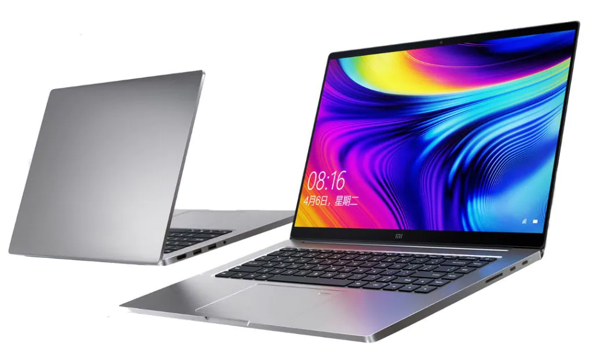
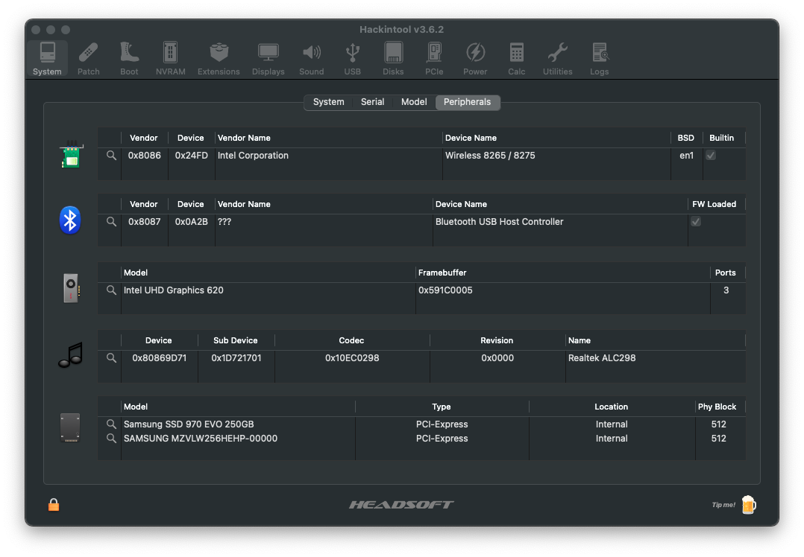
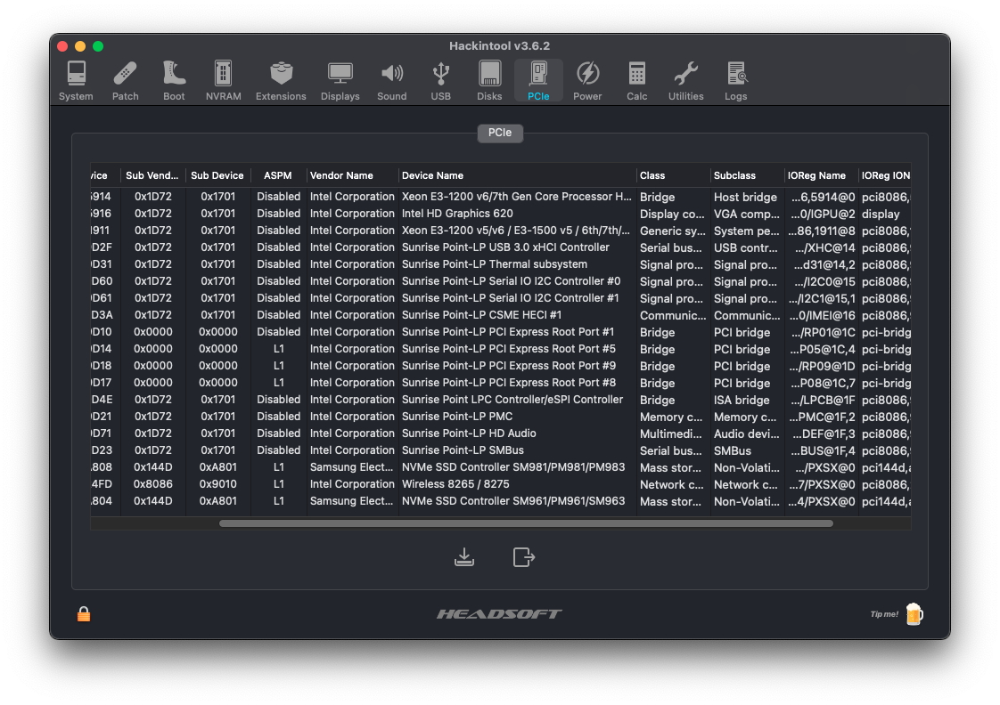
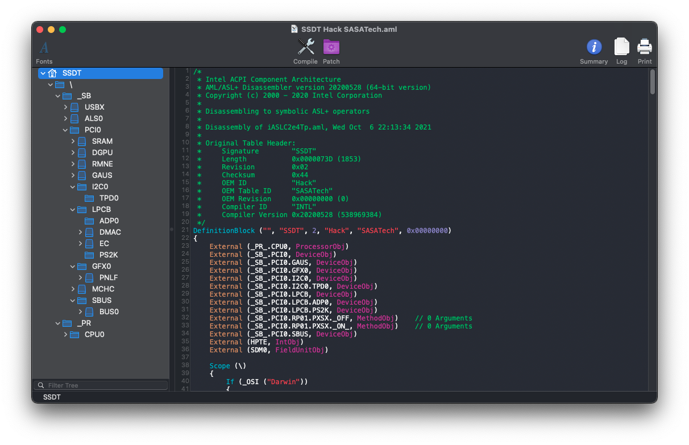

# Xiaomi-Notebook-Pro-Hackintosh

## macOS Big Sur/Monterey correttamente installato su Xiaomi Notebook Pro 2017/2018

# Specifiche:

| Componenti       | Modello                              |
| ---------------- | ------------------------------------ |
| Notebook         | Xiaomi Notebook Pro 2017/2018        | 
| CPU              | Intel Core i5 8250U/i7 8550U         | 
| iGPU             | Intel® UHD Graphics 620              |
| WiFi + Bluetooth | Intel Wireless-AC 8265               |
| Audio            | Realtek ALC298 (layout 30/99)        |
| RAM              | 8/16 GB DDR4 2400 Mhz                |
| NVMe             | Samsung PM961 256gb                  |
| SMBIOS           | MacBookPro15,2                       |
| Bootloader       | OpenCore 0.7.4                       |

## NOTE:
Ci sarebbe la NVIDIA GeForce MX150/MX250 che però, non essndo comaptibile con macOS viene disattivata per quest'ultimo.
Kexts aggiornati alle ultime versioni.

## Se volete installare la Beta 8 di macOS Monterey:
~~Vi lascio il config.plist rinominato in configbeta8.plist pronto da utilizzare SOLO per scaricare ed installare l'aggiornamento.
Al termine dell'aggiornamento dovete cancellarlo e rimettere l'originale config.plist.
È consigliabile scollegare l'Hackintosh dall'ID Apple prima di sostituire momentaneamente il config.plist, in alternativa usate il kexts RestrictEvents.~~

Con OpenCore 0.7.4 è stato fixato questo problema dell'aggiornamento.
Adesso potete aggiornare senza RestrictEvents.kexts e senza cambiare config.plist

# Impostazioni Bios

## Disabilita:

- Fast Boot
- Secure Boot

## Note sul BIOS:
Avere un BIOS semplice può sembrare un bene ma non lo è affatto.
Post installazione vi consiglio vivamente di sistemare i parametri relativi a DVMT Pre e Total, di fixare il CFG Lock e di disablilitare VT-d con l'ausilio dello strumento ru.efi
Solo dopo aver fatto ciò potrete togliere le spunte AppleXcpmCfgLock e DisableIoMapper, serve per avere un boot più fluido togliendo patch inutili.
  
# Dispositivo Screenshot

# Cosa funziona e cosa no:
- [x] Intel UHD 620 iGPU
- [x] Realtek ALC298
- [x] Realtek ALC298 HDMI Audio Output
- [x] Porte USB (Funzionano ma richiedono mappatura)
- [x] Intel WiFi e Bluetooth
- [x] NVRAM
- [x] Avvio Windows da OpenCore
- [ ] NVIDIA GeForce MX150/MX250
- [ ] Lettore Scheda SD integrato
- [ ] AirDrop, Hand-Off.

# Sezione Info SSDT Xiaomi Notebook Pro 8th

## Crediti

- [Acidanthera](https://github.com/acidanthera) per OpenCore Bootloader;
- [Apple](https://apple.com) per macOS;
- [HackintoshLifeIT](https://github.com/Hackintoshlifeit) Gruppo di supporto pre e post installazione;
- [Dortania](https://github.com/dortania) Per la guida OpenCore.

# Se avete bisogno di aiuto contattateci su [Telegram](https://t.me/HackintoshLife_it)
